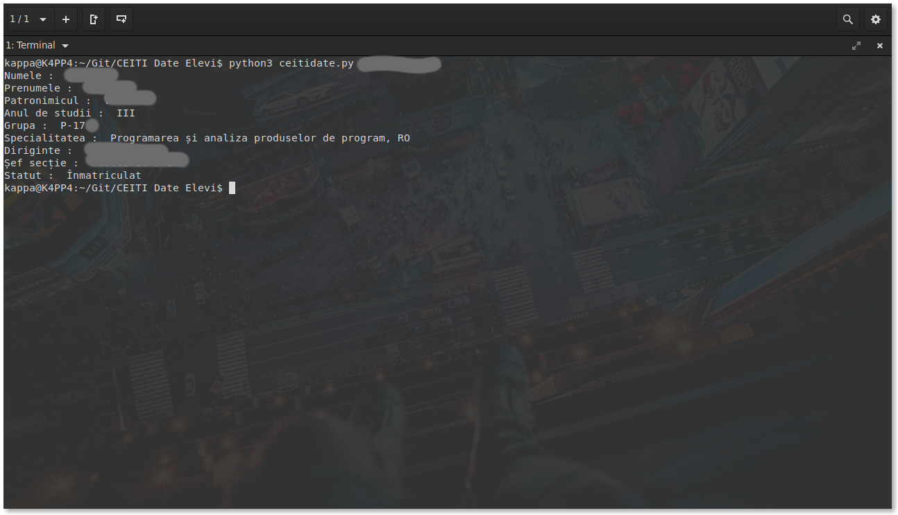

# CEITI Date Elevi
> Program **simplu** scris în python pentru a afişa în terminal anumite date ale unui elev de la [CEITI](https://ceiti.md/) folosind un POST request.



Introduceţi IDNP-ul ca paramentru sau la rularea programului(în cazul în care n-a fost găsit ca parametru)

## Cum îl rulez?

Linux/Windows/OS X/Android(Termux)/Whatever:
1. Descarcă şi instalează ultima versiune de [python](https://www.python.org/) pentru sistemul tău de operare.
2. Instalăm următoarele module python:
	* Requests
	* BeautifulSoup4
	```
	Folosind comanda:
	python -m pip install NumeModul
	```
3. Dublu-click pe ceitidate.py sau rulează din terminal:
```
python3 ceitidate.py [IDNP]
```
